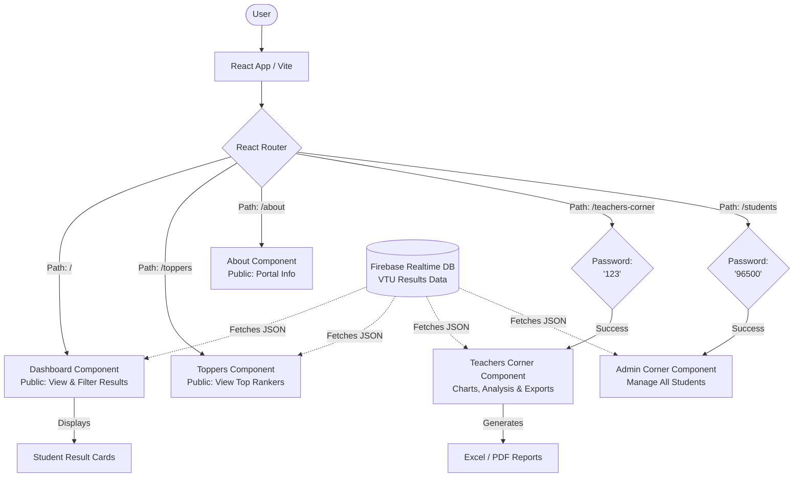

# BLDEACET VTU Results Portal Overview

## What is this project?
This project is a **Modern Web Dashboard** designed for **V.P. Dr. P.G. Halakatti College of Engineering & Technology (BLDEACET)** in Vijayapura. It serves as a centralized portal for students, teachers, and administrators to view, analyze, and manage Visvesvaraya Technological University (VTU) examination results.

### Key Technologies
- **Frontend Framework:** React 19 (built with Vite)
- **Routing:** React Router v7
- **UI & Styling:** Material UI (MUI), Emotion, Vanilla CSS
- **Data Visualization:** Chart.js, react-chartjs-2
- **Backend / Database:** Firebase (Realtime Database)
- **Exports & Reporting:** `xlsx` (Excel), `jspdf` / `html2canvas` (PDF), `docx` (Word), `pptxgenjs` (PowerPoint)

### Core Features
- **Public Dashboard:** Filter and search student results by branch, batch, and semester.
- **Toppers List:** Automatically calculates and displays top-ranking students.
- **Teachers Corner:** A protected area for faculty to analyze result statistics, view pass/fail metrics via pie charts, and export results data to Excel.
- **Admin Corner:** A protected area for administrators to access all student records.

---

## How Everything Works (Architecture & Data Flow)

The application functions as a Single Page Application (SPA) driven by React Router. When a user accesses the portal, they are routed to specific views based on the URL. Data is asynchronously fetched from Firebase Realtime Database and passed down to individual components for rendering and analysis.

### System Flowchart

## Component Breakdown
1. **`App.jsx`**: The root component that sets up the navigation bar (both mobile and desktop), handles scrolling states (footer visibility, mobile menu), implements simple password barriers for protected routes, and configures `react-router-dom`.
2. **`Dashboard.jsx`**: The main landing page. Handles generic data fetching and displays results using search and filter tools.
3. **`TeachersCorner.jsx`**: A specialized view for faculty. Uses `chart.js` to render result statistics visually and provides functionality to download formatted Excel sheets containing pass, fail, and absent metrics.
4. **`AllStudents.jsx`**: The Admin view, likely used for broader data management and debugging across all student batches.
5. **`Toppers.jsx`**: Contains the logic to sort students by SGPA/CGPA and renders the top performers dynamically.
